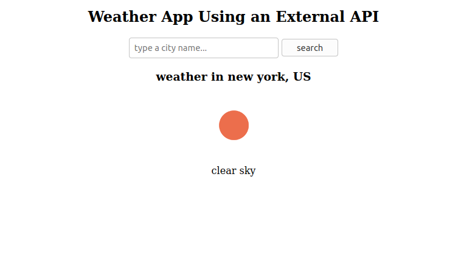

# weather_app
> weather frontend using JS and OpenWeatherMap API



## Built With

- HTML/CSS
- Javascript
- webpack

## Getting Started

To get a local copy up and running follow these simple example steps.

### Prerequisites

- A web browser

### Setup

- Clone or download the project to your local machine

- Change to the project's root directory

- create `dist/keys/config.js` and append to it 
```
const config = {
  TEST_KEY:'APPID_provided_by_openweathermap'
}
```

- run `npm install`

- to start:
  - run `npm run start` and navigate to dist directory in the opened window.

  - Or Open the index file with your browser
  ```javascript
  index.html
  ```
## Acknowledgement
- [fix long decimals in JS](https://stackoverflow.com/a/11832950/6010915)
## Author

👩‍💻 **Mohamed Sabry**

- GitHub: [@mohamedSabry0](https://github.com/mohamedSabry0)
- Twitter: [@mohsmh0](https://twitter.com/mohsmh0)
- LinkedIn: [Mohamed Sabry](https://linkedin.com/in/mohamed-sabry0/)

## 🤝 Contributing

Contributions, issues, and feature requests are welcome!

Feel free to check the [issues page](issues/).

## Show your support

Give a ⭐️ if you like this project!
